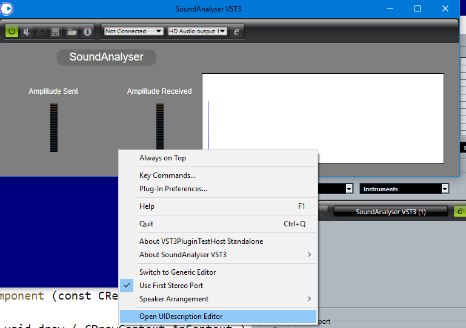
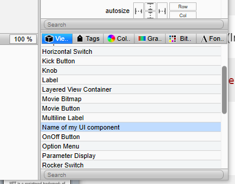

# Create your own view for the WYSIWYG editor in VSTGUI

## Introduction

When you want to edit your own VST3 plugin. You can find the need to create your own View.

You can edit your plugin by doing "Right click > Open UIDescription Editor"

You can find more information about this interface in the documentation : "VSTGUI 4 > VSTGUI > New Inline UI Editor for VST3 (WYSIWYG) > The Editor".

During this tutorial we will make a new view that will appear in the "Views Tab" at the bottom right of the editor and it allow us to drag and drop it inside our VST3 plugin.

## Create the new view class

To create a new graphical view you need to create a class that inherites from *CView* or *CControl*. We recommend that you start with the *CControl* class when you plan to have an interactive view, otherwise if it only should display data use *CView*.

Your header file should look like this :

~~~~~~~~~~~~~{.cpp}
#pragma once

#include "vstgui/vstgui.h"

namespace VSTGUI {

class MyControl : public CControl
{
public:
	MyControl (const CRect& size );
	
	void draw (CDrawContext *pContext) override;

	CLASS_METHODS (MyControl, CControl)
};

} // namespace VSTGUI
~~~~~~~~~~~~~

And your cpp file :

~~~~~~~~~~~~~{.cpp}
#include "MyControl.h"

namespace VSTGUI {

MyControl::MyControl (const CRect& size) : CControl (size) {}

void MyControl::draw (CDrawContext* pContext)
{
	// --- setup the background rectangle
	pContext->setLineWidth (1);
	pContext->setFillColor (CColor (255, 255, 255, 255)); // white background 
	pContext->setFrameColor (CColor (0, 0, 0, 255)); // black borders

	// --- draw the rect filled (with white) and stroked (line around rectangle)
	pContext->drawRect (getViewSize (), kDrawFilledAndStroked);

	setDirty (false);
}

} // namespace VSTGUI
~~~~~~~~~~~~~

We have two functions, the constructor which only calls the parent constructor and the *draw* function which will define the design of the view. In this example we draw a white rectangle with black borders.

## Register your view

So now you have a basic graphical view. But it will not appear in the list when you edit your plugin.

You need to create a new class, a "factory", that will register your view and create it. This class only needs a cpp file (if you strip dead code in your linker settings, then you need to make sure that this class is not stripped).

Let us begin by creating an empty class that inherites from  *'ViewCreatorAdapter'* :

~~~~~~~~~~~~~{.cpp}
#pragma once

#include "vstgui/vstgui.h"
#include "vstgui/vstgui_uidescription.h"
#include "vstgui/uidescription/detail/uiviewcreatorattributes.h"

// Replace this include by the header file of your new view.
#include "MyControl.h" 

namespace VSTGUI {

class MyControlFactory : public ViewCreatorAdapter
{
public:

};

} // namespace VSTGUI
~~~~~~~~~~~~~

In the constructor we need to register our view to the UIViewFactory. If we don't do that it will not appear in the list that will allow us to add the view to our VST3 plugin.

~~~~~~~~~~~~~{.cpp}
MyControlFactory () { UIViewFactory::registerViewCreator (*this); }
~~~~~~~~~~~~~

The main factory needs 3 others functions :

* The name of the view (as shown in the WYSIWYS editor)

~~~~~~~~~~~~~{.cpp}
IdStringPtr getViewName () const { return "Name of my UI component"; }
~~~~~~~~~~~~~

* The parent class of the view (In this tutorial we're using *CControl*)

~~~~~~~~~~~~~{.cpp}
IdStringPtr getBaseViewName () const { return UIViewCreator::kCControl; }
~~~~~~~~~~~~~

* and a creator method which returns a new view with a default size

~~~~~~~~~~~~~{.cpp}
CView* create (const UIAttributes& attributes, const IUIDescription* description) const
{
	return new MyControl (CRect (0, 0, 100, 100));
}
~~~~~~~~~~~~~

You also need to create a static variable having the same type as our factory. This variable will call the constructor of your factory. Thus, your view will be registered automatically.

~~~~~~~~~~~~~{.cpp}
MyControlFactory __gMyControlFactory;
~~~~~~~~~~~~~

So at the end you should have something like this :

~~~~~~~~~~~~~{.cpp}
#pragma once
#include "vstgui/vstgui.h"
#include "vstgui/vstgui_uidescription.h"
#include "vstgui/uidescription/detail/uiviewcreatorattributes.h"
#include "MyControl.h"

namespace VSTGUI {

class MyControlFactory : public ViewCreatorAdapter
{
public:
	// register this class with the view factory
	MyControlFactory () { UIViewFactory::registerViewCreator (*this); }

	// return an unique name here
	IdStringPtr getViewName () const override { return "Name of my UI component"; }

	// return the name here from where your custom view inherites.
	// Your view automatically supports the attributes from it.
	IdStringPtr getBaseViewName () const override { return UIViewCreator::kCControl; }

	// create your view here.
	// Note you don't need to apply attributes here as
	// the apply method will be called with this new view
	CView* create (const UIAttributes& attributes, const IUIDescription* description) const override
	{
		CRect size (CPoint (45, 45), CPoint (400, 150) );
		return new MyControl (size);
	}
};
// create a static instance so that it registers itself with the view factory
MyControlFactory __gMyControlFactory;

} // namespace VSTGUI
~~~~~~~~~~~~~

## Result

Now if you come back to the VST 3 plugin Editor you can find your new view in the list.

